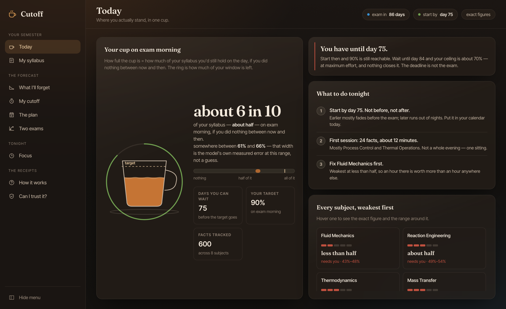
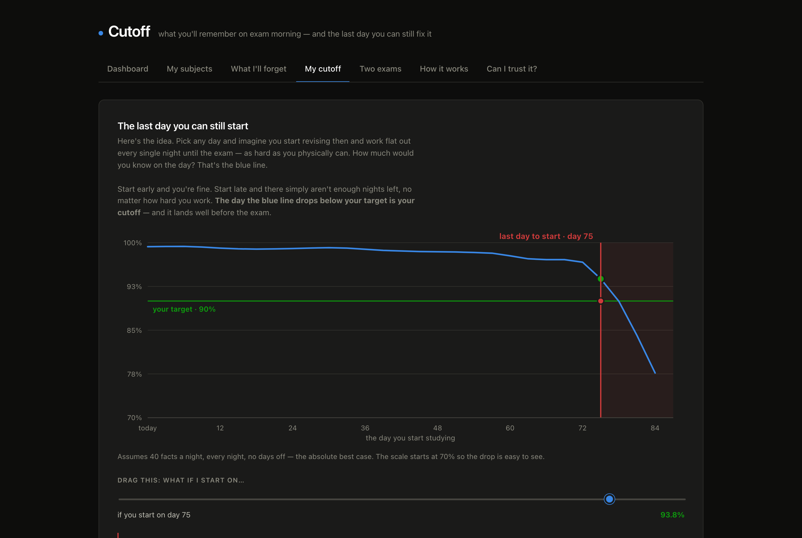
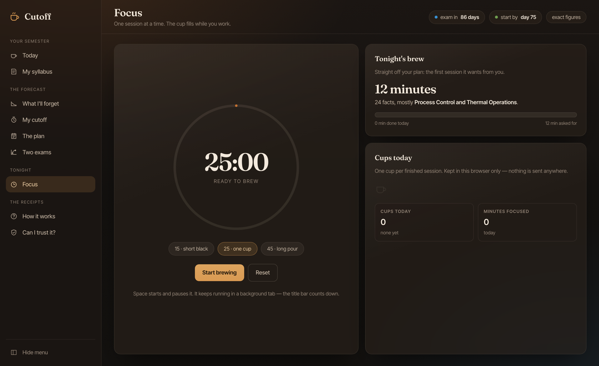
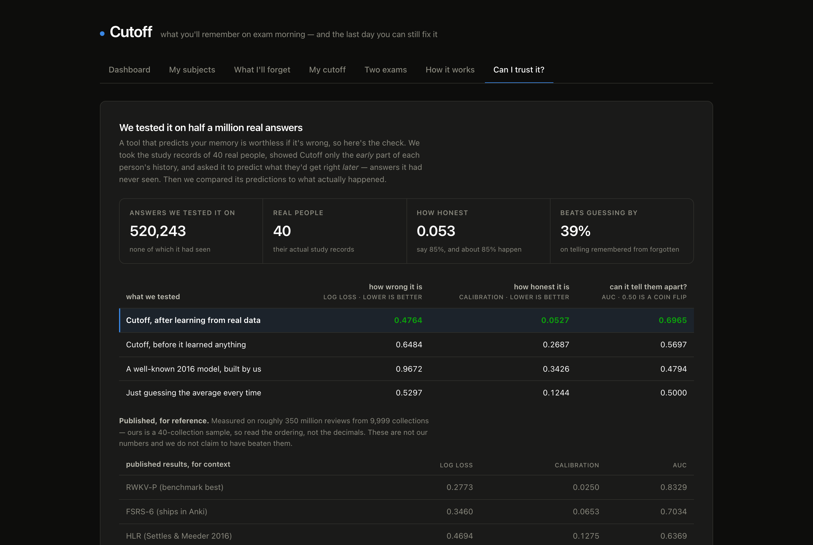

# Cutoff

**What you'll remember on exam morning — and the last day you can still do something about it.**

**▶ Live: [cutoff-gray.vercel.app](https://cutoff-gray.vercel.app)** — it loads with a real semester already
forecast, so there is nothing to sign up for and nothing to fill in first.

Paste your syllabus. Say how well you know each subject. Cutoff forecasts, per
concept, the probability you'll still recall it on the morning of your exam —
then finds the smallest schedule that gets you to your target, and the **last
day you can start and still reach it.**



---

## The thing nobody else computes

Spaced-repetition schedulers answer *"what should I review today?"* Cutoff
answers a different question, and it is the one a student in a semester actually
has:

> Given everything I've studied, one fixed exam date, and the fact that I can
> only get through about forty cards a night — **is my target still reachable,
> and when does it stop being reachable?**

Because each night has a ceiling, there is a last day you can begin and still
land on 90%. Start a day later and the number you top out at is lower, **and no
amount of effort closes it.** That day is your cutoff.



The deadline was never the exam.

---

## Every number is a range, because that is all we earned

Cutoff does not tell you "83.4%". It tells you **"about 8 in 10 — somewhere
between 79% and 84%"**, and that width is not a design flourish. It is the
model's own error at that distance, read off the calibration table in
`artifacts/calibration.json`: the measured bias at that horizon, widened by the
expected calibration error.

Three months out the model runs **2.3 points overconfident**, so three months
out the range is shifted down by 2.3 points. The honesty screen is not a
footnote at the bottom of the site — it is the source of every figure on every
other screen.

`exact figures` in the top bar puts the raw model output back, for anyone who
wants to check the arithmetic.

---

## No language model computes any of this

The forecast, the ceiling and the plan are arithmetic over a **difficulty–
stability–retrievability memory model we fitted ourselves** on real study logs.
Every number on screen is re-derivable from the committed code and the committed
16-float model in `artifacts/dsr.json`.

A language model appears in exactly one file — `cutoff/ingest/llm.py` — where it
reads your pasted syllabus and splits it into subjects and topics. It is an
extractor. Delete it and the product still runs, on a parser that needs no
network and no key; every forecast would be identical.

This is deliberate. Ask a chatbot *"how much of this will I remember on November
20th"* and you get a confident number with nothing behind it. The entire point
of Cutoff is that the number has something behind it.

---

## The interface

Nine screens rather than one long page: **Today** (your whole semester as one
cup — it pours itself to what you'd hold on exam morning, the dashed ring on the
glass is your target, and the arc beneath it is how much of your window is
left), **My syllabus**, **What I'll forget** (the same figure as a gauge, beside
the headline), **My cutoff**, **The plan**,
**Two exams**, **Focus**, **How it works**, **Can I trust it?**

The **Focus** screen is a session timer that finishes in cups, and it knows what
tonight is supposed to be: it reads the first session off your plan, so the
number on the clock is the number the planner asked for. Session counts live in
your browser and nowhere else — there is no account and nothing is sent
anywhere.



Every chart is drawn by hand in SVG, sized to its container rather than to a
fixed viewBox, and interactive by default — a crosshair that snaps to a day, a
legend that isolates a subject, a cutoff line you can drag. The chart palette is
run through a colour-vision validator against this exact surface; status colours
are reserved and never carry meaning without a word beside them.

---

## Does it actually work?

Fitted on 40 real Anki collections, scored on each learner's **future** reviews —
the last 20% of every card's history, which the model never saw.

| | log loss | calibration | AUC |
|---|---|---|---|
| **Cutoff (fitted)** | **0.4764** | **0.0527** | **0.6965** |
| Cutoff (unfitted defaults) | 0.6484 | 0.2687 | 0.5697 |
| HLR (ACL 2016, our implementation) | 0.9672 | 0.3426 | 0.4794 |
| Predict the mean | 0.5297 | 0.1244 | 0.5000 |

*520,243 held-out reviews. Regenerate with `python scripts/benchmark.py --collections 40`.*

⚠️ **The published FSRS-6 numbers (0.3460 / 0.0653 / 0.7034) are measured on
~350 M reviews across 9,999 collections. Ours is a 40-collection sample. Read
the ordering, not the decimals — we have not beaten FSRS and do not claim to.**

Calibration matters more than accuracy here, because the product shows you a
number and you plan around it. Expected calibration error is **0.0244** across
520,243 reviews, and **2.3 points** three months out — which is the horizon the
whole premise depends on, and the number every range in the product is built
from.



---

## Three things we were wrong about

Kept in the product, on the "Can I trust it?" screen, because a tool that hides
its failures has not earned the forecast it shows you.

1. **Duolingo's 12.85 M traces have almost no forgetting curve.** Recall barely
   moves with time — 90.6% under a day, 86.8% after a month. The scheduler grants
   58 days after a success and 10.4 after a lapse, so a long gap is a *reward for
   strength* and the two effects cancel. Conditioning on repetition number brings
   the curve back. We moved to Anki logs, where people genuinely forget.

2. **Half-Life Regression loses to predicting the average on this data.** We
   implemented the ACL 2016 model and reproduced its published baselines within a
   few points — then watched it score below chance on Anki reviews, because it
   has no notion of stability and reads a long gap as weakness. That failure is
   the argument for a DSR model.

3. **Cramming beats spacing for one fixed exam date, at every horizon.** In our
   own model, at identical effort: 90.0% crammed against 75.4% spread evenly —
   and cramming still leads three months later. We are not going to tell you
   otherwise. What makes scheduling matter is that you *cannot* sit through six
   hundred cards the night before — and once each night has a limit, there is a
   last day you can start.

---

## Anki already exists, and FSRS is better than anything we could write in five days

We use that model class, and we say so. What Anki will not tell you is what
you'll know on **November 20th**, or the cheapest path to 90% by then, or the
day after which 90% stops being possible. That layer is what this is.

---

## Run it

```bash
python -m venv .venv && source .venv/bin/activate
pip install -r requirements.txt
uvicorn cutoff.api.main:app --reload
# → http://127.0.0.1:8000
```

Deployed on Vercel from `api/index.py`; the Render blueprint in `render.yaml`
runs the same app unchanged. One service, one origin: the API serves the interface from its own port, so
there is no API base URL to configure and no CORS to get wrong. The interface is
hand-written — no bundler, no build step, and the charts are drawn in SVG rather
than pulled from a chart library. Because there is no bundler to fingerprint the
files, the index route stamps the script URL with its mtime and serves both
no-store; a visitor holding a cached client can never meet fresh markup.

Optional — better syllabus reading:

```bash
export GEMINI_API_KEY=...      # without it, the built-in parser is used
```

Training and evaluation (needs the review-log corpora, which are not committed):

```bash
pip install -r requirements-dev.txt
python scripts/benchmark.py --collections 40
python scripts/calibration.py
python -m pytest tests/ -q
```

---

## Layout

```
cutoff/model/      the memory models — DSR (shipped) and HLR (the 2016 baseline)
cutoff/core/       forecast, capacity-constrained planner, two-exam frontier
cutoff/eval/       held-out scoring against the community benchmark's metrics
cutoff/ingest/     syllabus → subjects and topics. The only place an LLM runs.
cutoff/api/        FastAPI. Stateless — the client holds its own cards.
web/               the interface — two files. No build step, charts hand-drawn in SVG.
artifacts/         the fitted model and the measured scores, both committed
tests/             properties the product's claims depend on
```

## Provenance

- Settles & Meeder, **ACL 2016**, *A Trainable Spaced Repetition Model for Language Learning* — [10.18653/v1/P16-1174](https://doi.org/10.18653/v1/P16-1174)
- Tabibian et al., **PNAS 2019**, *Enhancing human learning via spaced repetition optimization*
- Duolingo 13 M learning traces — Harvard Dataverse [doi:10.7910/DVN/N8XJME](https://doi.org/10.7910/DVN/N8XJME), MIT licence
- Anki review logs — [`open-spaced-repetition/fsrs-dataset`](https://huggingface.co/datasets/open-spaced-repetition/FSRS-Anki-20k)
- Metrics and published comparison figures — [`open-spaced-repetition/srs-benchmark`](https://github.com/open-spaced-repetition/srs-benchmark)

Built for the **Prometheus September AI Challenge**, August 2026.
